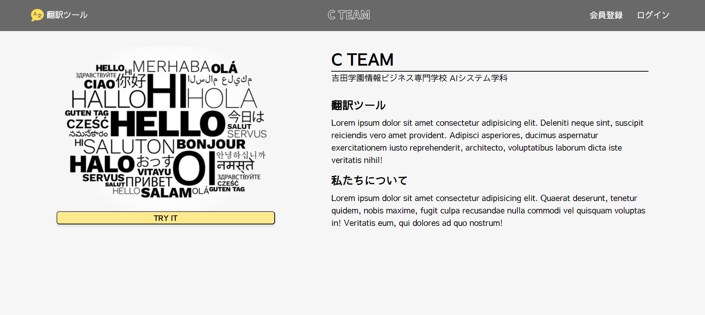
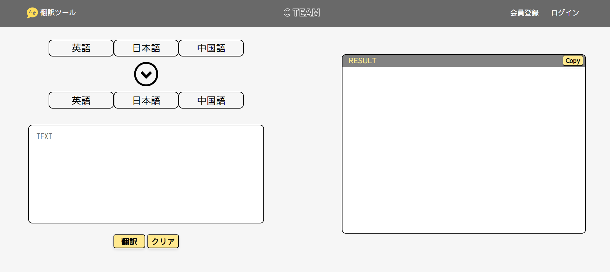
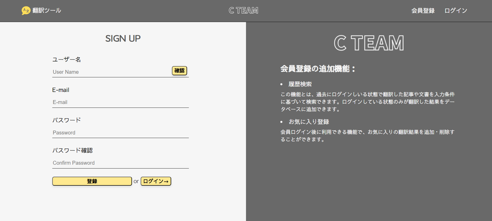
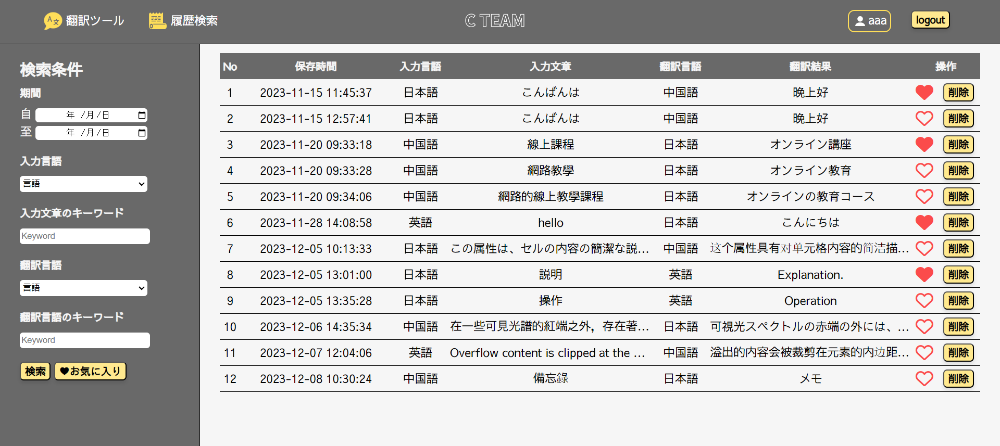

# 翻訳ウェブアプリケーション

このプロジェクトは、OpenAI API を使用して言語翻訳を行う翻訳ウェブアプリケーションです。Flask、JavaScript、HTML、CSS の技術を使用して構築されています。

## 機能

- **翻訳機能：** このアプリケーションの主要な機能は、OpenAI API を使用してテキストを翻訳することです。ユーザーは一つの言語でテキストを入力し、希望する言語で翻訳されたテキストを取得できます。

  
- **ユーザー登録：** ユーザーはアカウントを登録することができます。登録したユーザーはログインして追加の機能にアクセスできます。

  
- **翻訳履歴：** ログインすると、ユーザーは自分の翻訳履歴を表示できます。この機能により、ユーザーは以前の翻訳を参照することができます。
  
- **お気に入り機能：** アカウントにログインしているユーザーは、特定の翻訳をお気に入りにマークすることができます。この機能により、ユーザーはお気に入りの翻訳テキストを保存して簡単にアクセスできます。

  

## 使用技術

- **Flask：** アプリケーションのバックエンドは、Python の Web フレームワークである Flask を使用して構築されています。
  
- **JavaScript：** クライアント側の機能および Web アプリケーション内の対話に使用されています。
  
- **HTML：** Web ページの構造とコンテンツを提供します。
  
- **CSS：** スタイルとレイアウトを目的として使用し、アプリケーションの視覚的な魅力とユーザーエクスペリエンスを向上させます。
  

## 使い方

このアプリケーションをローカルで使用するには：

1. このリポジトリをローカルマシンにクローンします。
2. `pip install -r requirements.txt` を実行して必要な依存関係をインストールします。
3. OpenAI API キーの必要な環境変数を設定します。
4. `python main.py` を実行して Flask アプリケーションを起動します。
5. Web ブラウザで `http://localhost:5000` にアクセスしてアプリケーションにアクセスします。

# Translation Web Application

This project is a translation web application that utilizes the OpenAI API for language translation purposes. It is built using Flask, JavaScript, HTML, and CSS technologies.

# Features

- Translation Functionality: The primary feature of this application is its ability to translate text using the OpenAI API. Users can input text in one language and obtain the translated text in their desired language.

- User Registration: Users have the option to register an account. Registered users can log in to access additional features.
  
- Translation History: Once logged in, users can view their translation history. This feature allows them to retrieve their previous translations for reference purposes.
  
- Favorites Functionality: Users logged in to their accounts can mark specific translations as favorites. This feature enables users to save and easily access their favorite translated texts.
  

# Technologies Used

- Flask: The backend of the application is built using Flask, a web framework for Python.
  
- JavaScript: Used for client-side functionalities and interactivity within the web application.
  
- HTML: Provides the structure and content for the web pages.
  
- CSS: Used for styling and layout purposes, enhancing the visual appeal and user experience of the application.
  

# Usage

To use this application locally:

1. Clone this repository to your local machine.
  
2. Install the required dependencies by running pip install -r requirements.txt.
  
3. Set up the necessary environment variables for the OpenAI API keys.
  
4. Run the Flask application by executing python main.py.
  
5. Access the application through your web browser at http://localhost:5000.
  

# 翻譯網頁應用程式

這個專案是一個翻譯網頁應用程式，利用 OpenAI API 進行語言翻譯。使用了 Flask、JavaScript、HTML 和 CSS 技術來構建。

## 功能

- **翻譯功能：** 這個應用程式的主要功能是使用 OpenAI API 進行文本翻譯。使用者可以輸入一種語言的文本，並獲取其想要的語言的翻譯文本。
  
- **使用者註冊：** 使用者有註冊帳戶的選擇。註冊的使用者可以登錄以訪問其他功能。
  
- **翻譯歷史：** 登錄後，使用者可以查看他們的翻譯歷史。這個功能允許使用者檢索以前的翻譯，供參考之用。
  
- **最愛功能：** 登錄帳戶的使用者可以將特定翻譯標記為最愛。這個功能使使用者可以保存並輕鬆訪問他們最喜歡的翻譯文本。
  

## 使用的技術

- **Flask：** 應用程式的後端是使用 Flask，這是 Python 的一個 Web 框架。
  
- **JavaScript：** 用於客戶端功能和 Web 應用程式的互動。
  
- **HTML：** 為 Web 頁面提供結構和內容。
  
- **CSS：** 用於樣式和版面配置，增強應用程式的視覺吸引力和用戶體驗。
  

## 使用方法

要在本地使用此應用程式：

1. 將此存儲庫克隆到您的本地計算機。
2. 通過運行 `pip install -r requirements.txt` 安裝所需的依賴項。
3. 設置 OpenAI API 金鑰的必要環境變量。
4. 通過執行 `python main.py` 運行 Flask 應用程式。
5. 在網絡瀏覽器中進入 `http://localhost:5000` 訪問應用程式。
